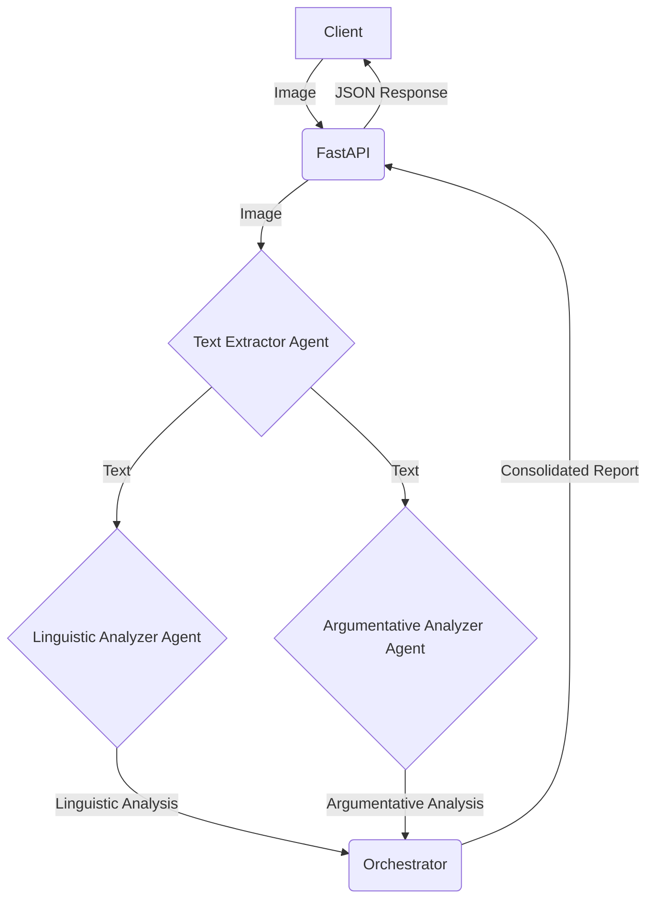

# Text Analyzer Agent Workflow

This application is a multi-agent text analysis workflow designed to be deployed as a Cloud Run service. It receives an image, extracts text from it, and performs linguistic and argumentative analysis on the extracted text using a collection of specialized agents.

## Project Structure

```
.
├── app/
│   ├── agents/
│   │   ├── argumentative_analyzer.py
│   │   ├── linguistic_analyzer.py
│   │   └── text_extractor.py
│   ├── services/
│   │   ├── cache.py
│   │   └── status.py
│   ├── utils/
│   │   └── file_loader.py
│   └── main.py
├── argumentative.md
├── linguistics.md
├── Dockerfile
├── README.md
└── requirements.txt
```

*   **`app/`**: The main application directory.
    *   **`agents/`**: Contains the specialized agents responsible for specific tasks in the workflow.
        *   `text_extractor.py`: Extracts text from an image.
        *   `linguistic_analyzer.py`: Performs linguistic analysis on the text.
        *   `argumentative_analyzer.py`: Performs argumentative analysis on the text.
    *   **`services/`**: Contains services used by the application, such as caching and status tracking.
    *   **`utils/`**: Contains utility functions, such as loading instruction files.
    *   **`main.py`**: The main FastAPI application file, which defines the API endpoints and orchestrates the workflow.
*   **`argumentative.md`**: The instruction prompt for the argumentative analyzer agent.
*   **`linguistics.md`**: The instruction prompt for the linguistic analyzer agent.
*   **`Dockerfile`**: The Dockerfile for building the container image.
*   **`README.md`**: This file.
*   **`requirements.txt`**: The Python dependencies.

## Workflow

The workflow is orchestrated by the `main.py` file and consists of the following steps:

1.  **Input**: An image is sent to the `/analyze-image/` REST endpoint via a POST request.
2.  **Text Extraction**: The `TextExtractorAgent` extracts text from the image.
3.  **Parallel Analysis**: The `LinguisticAnalyzerAgent` and `ArgumentativeAnalyzerAgent` run in parallel to analyze the extracted text.
4.  **Consolidation**: The orchestrator gathers the results from all agents.
5.  **Output**: A consolidated JSON report is returned.

The application includes a simple in-memory cache to avoid re-processing the same image and a status endpoint to track the execution of the agents.



## Setup

1.  **Install dependencies:**
    ```bash
    pip install -r requirements.txt
    ```

2.  **Set Environment Variables:**
    You need to set your Google API key as an environment variable.
    ```bash
    export GOOGLE_API_KEY="<your_api_key>"
    ```

## Running Locally

To run the application locally:
```bash
python -m venv .venv
.venv\Scripts\activate.bat
.venv\Scripts\Activate.ps1


uvicorn app.main:app --reload
```
The server will start on `http://127.0.0.1:8000`.

## API Endpoints

*   `POST /analyze-image/`:
    *   **Description**: Analyzes an image by extracting text and performing linguistic and argumentative analysis.
    *   **Request Body**: `multipart/form-data` with the following fields:
        *   `file`: The image file to analyze.
        *   `topic`: The topic for the argumentative analysis.
        *   `motivational_texts` (optional): Motivational texts to provide context for the argumentative analysis.
    *   **Response**:
        *   **202 Accepted**: If the analysis is started successfully. The response body will contain a `run_id` that can be used to track the status of the analysis.
        *   **200 OK**: If the result is retrieved from the cache. The response body will contain the cached analysis report.

*   `GET /status/{run_id}`:
    *   **Description**: Gets the status of an analysis run.
    *   **Path Parameter**: `run_id` (string) - The ID of the analysis run, returned by the `/analyze-image/` endpoint.
    *   **Response**: A JSON object with the status of each agent in the workflow (e.g., `PENDING`, `RUNNING`, `COMPLETED`, `FAILED`).

## Deployment (Cloud Run)

1.  **Build the Docker image:**
    ```bash
    docker build -t text-analyzer-agent .
    ```

2.  **Push the image to Google Container Registry (GCR):**
    ```bash
    docker tag text-analyzer-agent gcr.io/YOUR_PROJECT_ID/text-analyzer-agent
    docker push gcr.io/YOUR_PROJECT_ID/text-analyzer-agent
    ```

3.  **Deploy to Cloud Run:**
    ```bash
    gcloud run deploy text-analyzer-agent \
        --image gcr.io/YOUR_PROJECT_ID/text-analyzer-agent \
        --platform managed \
        --region YOUR_REGION \
        --allow-unauthenticated \
        --set-env-vars GOOGLE_API_KEY="<your_api_key>"
    ```
    Replace `YOUR_PROJECT_ID` and `YOUR_REGION` with your Google Cloud project details.